<div align="center">

# Bazaar<span>Nile</span>

### Egypt's marketplace for independent sellers — with an AI shopping guide built in.

Discover products from makers, roasters, and small shops across Egypt. Search by text or by photo, ask an AI guide for advice, pay cash on delivery, and shop in **English or Arabic**.

[**🛍️ Live demo**](https://bazaarnile.vercel.app) &nbsp;·&nbsp; [Features](#-features) &nbsp;·&nbsp; [Screenshots](#-a-closer-look) &nbsp;·&nbsp; [Architecture](#-architecture) &nbsp;·&nbsp; [Run it locally](#-run-it-locally)


<br/>

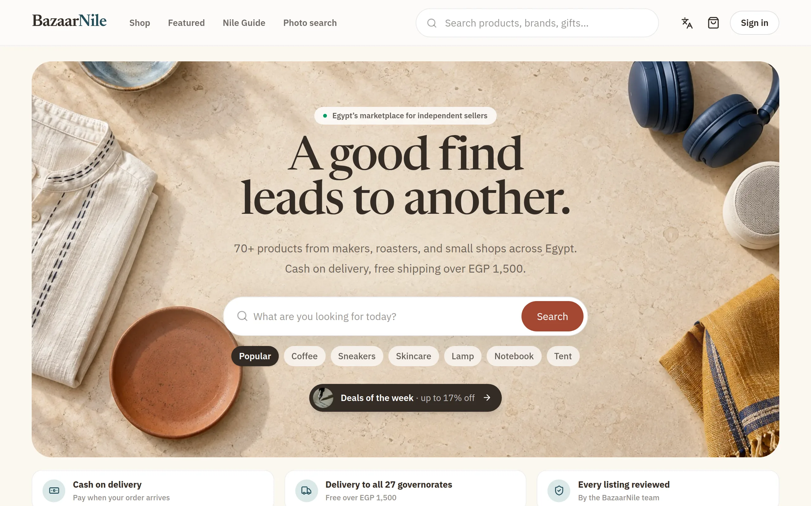

</div>

<br/>

## ✨ Highlights

<table>
<tr>
<td width="33%" valign="top">

### 🤖 AI that actually shops
**Nile Guide** chats with shoppers, compares the *live* catalog, and recommends products that are really in stock. **Photo search** finds look-alikes from a picture. One-tap **AI summaries** explain any product or the whole cart.

</td>
<td width="33%" valign="top">

### 🌍 English & Arabic
A full **right-to-left** Arabic experience — every screen, message, and notification — with proper Arabic plural rules, Arabic typography, and AI answers in the shopper's language.

</td>
<td width="33%" valign="top">

### 🏪 A real multi-vendor marketplace
Sellers list products with **sizes and colours**, track stock per option, and follow every sale. Admins moderate listings, manage orders and users, restock inventory, and run coupons.

</td>
</tr>
</table>

<br/>

## 🧭 Features

<details open>
<summary><b>For shoppers</b></summary>

- **Search that helps you type** — instant suggestions for products and categories, keyboard-navigable
- **Filters that matter** — price ranges, *4★ & up*, on sale, in stock, featured, and every category, all kept in the URL
- **Product options** — pick a size and colour; sold-out combinations are crossed out and stock updates per choice
- **Ratings & reviews** — star breakdown you can filter by, sorting, *Verified purchase* badges, write/edit/delete your own
- **Honest urgency** — "Only 3 left" appears in red only when it's true
- **Cart & checkout** — free-shipping progress meter, coupons, saved addresses, and **cash on delivery**
- **Orders** — live progress tracker, cancellation while it's still possible, and in-app notifications
- **Wishlist, recommendations** ("Picked for you"), and an account area for profile, addresses, and password
- **Nile Guide & AI summaries** remember where you left off until you start a new conversation

</details>

<details>
<summary><b>For sellers — Seller Center</b></summary>

- Business overview: delivered revenue, units sold, 14-day sales chart, top products, stock alerts
- Product editor with live preview, image gallery, compare-at prices, and drafts
- **Options editor** — enter `S, M, L` and `Black, White`; every combination gets its own stock
- Listings go through admin review before they appear in the shop

</details>

<details>
<summary><b>For admins — Marketplace control room</b></summary>

- Marketplace metrics: GMV, orders, members, repeat-customer rate, top sellers, category sales
- **Inventory** — stock health tiles, filters for low / out of stock, quick restock, per-option stock
- Order management with safe status transitions (stock and coupons are restored on cancellation)
- Listing moderation, user roles and suspension, review moderation, and a full **coupon** manager

</details>

<br/>

## 📸 A closer look

<table>
<tr>
<td width="50%">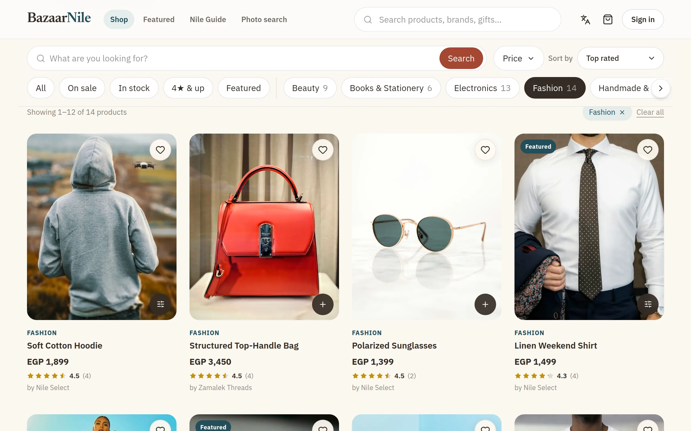<br/><sub><b>Shop</b> — filters, ratings, and quick add</sub></td>
<td width="50%">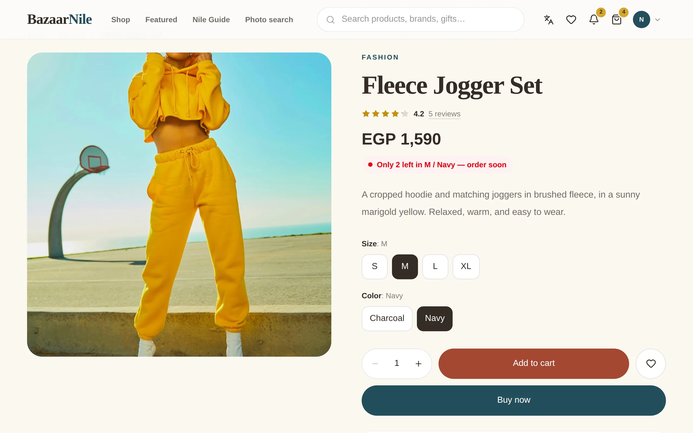<br/><sub><b>Product</b> — options with per-option stock</sub></td>
</tr>
<tr>
<td width="50%">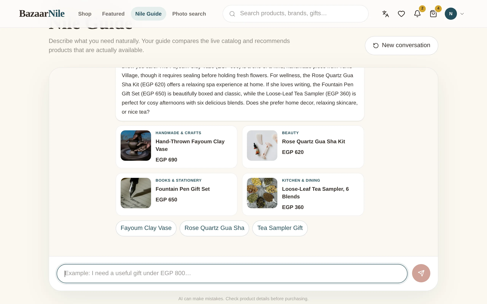<br/><sub><b>Nile Guide</b> — an AI assistant that recommends real, in-stock products</sub></td>
<td width="50%">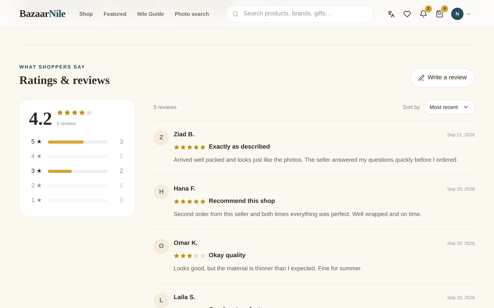<br/><sub><b>Ratings & reviews</b> — filter by stars, sort, write your own</sub></td>
</tr>
<tr>
<td width="50%">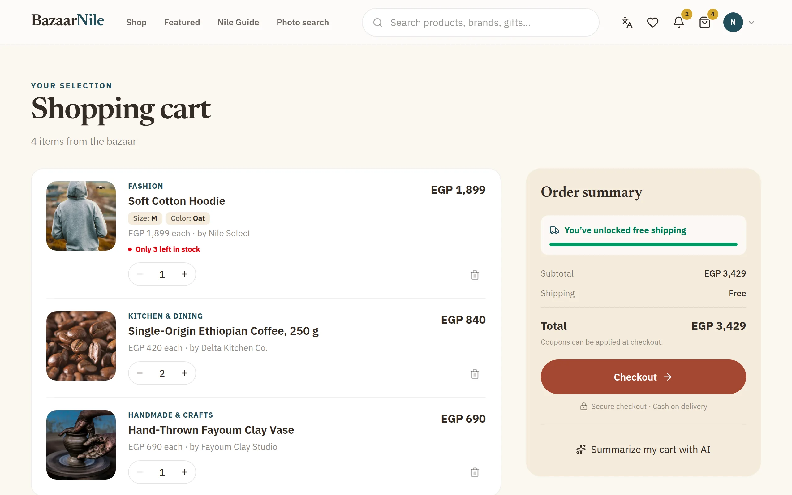<br/><sub><b>Cart</b> — free-shipping meter and AI cart summary</sub></td>
<td width="50%">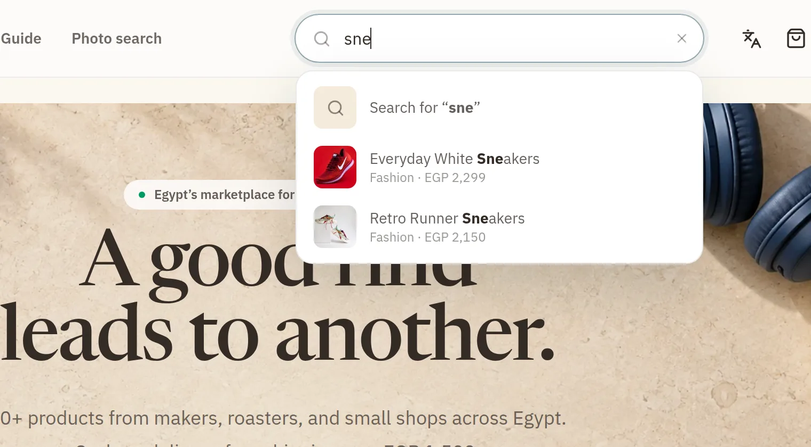<br/><sub><b>Search</b> — suggestions as you type</sub></td>
</tr>
<tr>
<td width="50%">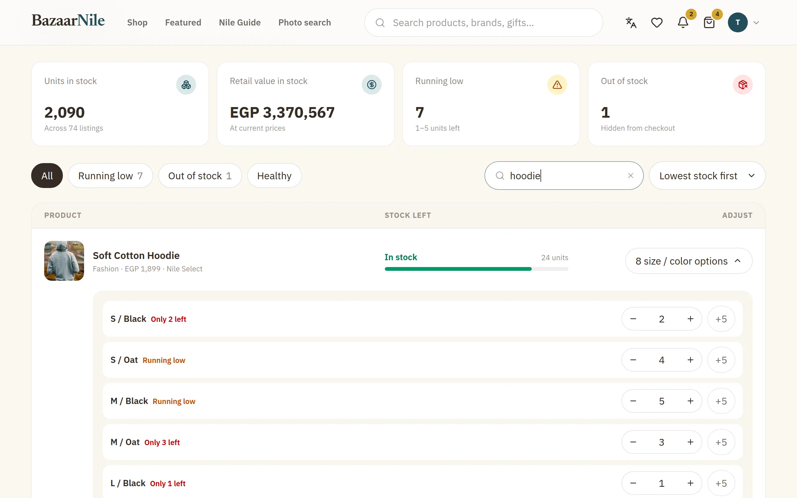<br/><sub><b>Admin inventory</b> — restock any size or colour</sub></td>
<td width="50%">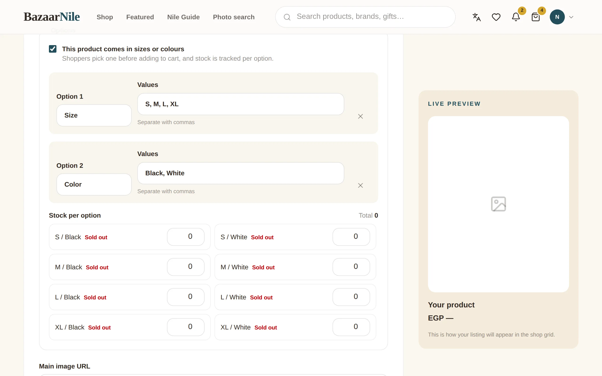<br/><sub><b>Seller Center</b> — options editor with stock per combination</sub></td>
</tr>
</table>

### بالعربية — Arabic, right to left

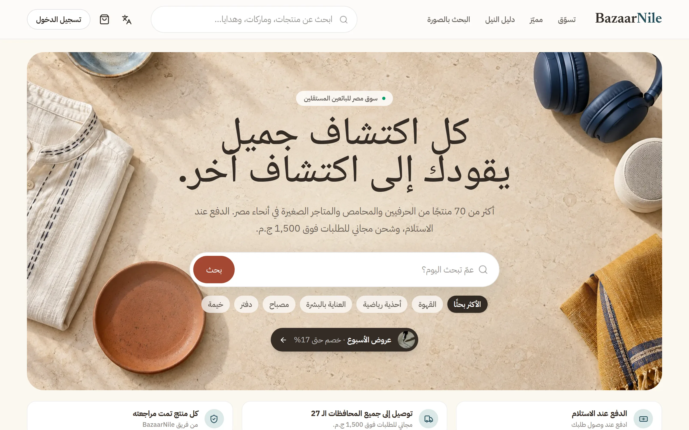

### 📱 Built for phones

<table>
<tr>
<td align="center" width="33%">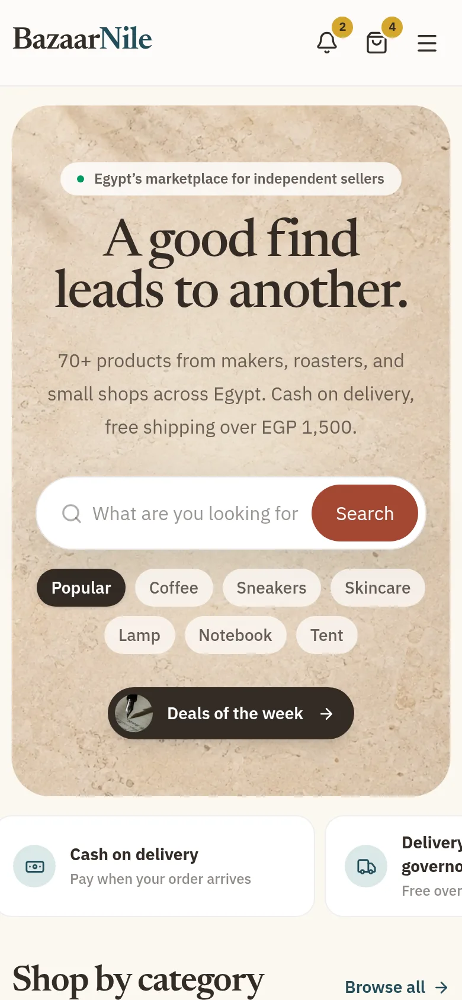<br/><sub>Home</sub></td>
<td align="center" width="33%">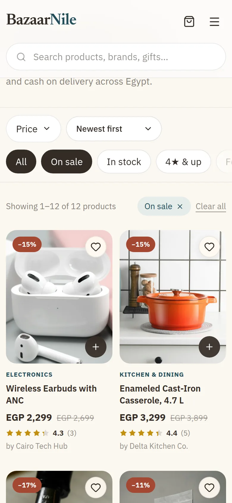<br/><sub>Deals of the week</sub></td>
<td align="center" width="33%"><br/><sub>Product, in Arabic</sub></td>
</tr>
</table>

<br/>

## 🏗 Architecture

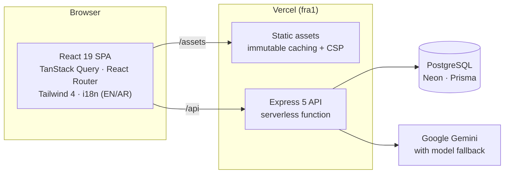

The storefront and the API ship from one Vercel project on the same origin, deployed next to the database in Frankfurt for low-latency queries.

| Layer | Technology |
| --- | --- |
| **Frontend** | React 19, TypeScript, Vite 7, Tailwind CSS 4, TanStack Query 5, React Router 7, Framer Motion, Lucide icons |
| **Backend** | Node.js, Express 5, Zod 4 validation, Prisma 6, PostgreSQL (Neon) |
| **Auth** | Short-lived JWT access tokens in memory, rotating httpOnly refresh cookies, bcrypt |
| **AI** | Google Gemini — product & cart summaries, conversational assistant, visual search |
| **Hosting** | Vercel (static + serverless API), Neon serverless Postgres |

<br/>

## 🛡 Built carefully

<table>
<tr>
<td width="50%" valign="top">

**Security**
- Access tokens never touch `localStorage`; refresh tokens rotate on every use and are revoked on sign-out
- Rate limits shared across serverless instances (stored in Postgres) for sign-in, sign-up, reviews, and AI
- Strict Content-Security-Policy, HSTS, and frame protection
- Every input validated with Zod; image URLs restricted to `http(s)`
- AI prompts treat catalog and user text as untrusted data

</td>
<td width="50%" valign="top">

**Reliability & performance**
- Serializable checkout transactions — stock can't oversell, even per size/colour
- Two-step database migrations so deploys never break live carts
- Dashboards aggregate in SQL; ratings are denormalized for fast sorting
- Code-split routes and a lazy-loaded Arabic dictionary
- Gemini calls retry and fall back to lighter models when one is overloaded

</td>
</tr>
</table>

**Accessible by default:** keyboard-friendly menus and dialogs with focus management, ARIA comboboxes and radio groups, screen-reader labels in both languages, and no horizontal scrolling down to 390 px.

<br/>

## 🚀 Run it locally

**Requirements:** Node.js 20+, a PostgreSQL database (a free [Neon](https://neon.tech) project works), and optionally a [Google AI Studio](https://aistudio.google.com) key for the AI features.

```bash
# 1. Install
git clone https://github.com/Marnie0/BazaarNile.git
cd BazaarNile
npm install

# 2. Configure (see .env.example for every variable)
cp .env.example apps/api/.env                                    # API settings
echo 'VITE_API_URL="http://localhost:4000/api"' > apps/web/.env.local

# 3. Database
npm run db:generate
npm run db:migrate
npm run db:seed                                   # starter data + demo seller (password printed once)
npm run db:seed:catalog -w @bazaarnile/api        # 8 categories, 8 shops, 70+ products
npm run db:seed:reviews -w @bazaarnile/api        # sizes/colours and demo reviews

# 4. Start the API and storefront together
npm run dev
```

Open **http://localhost:5173** — the API runs on **http://localhost:4000**.

> Without `GEMINI_API_KEY` everything works except the AI features, which explain that they aren't configured yet.

### Useful scripts

| Command | What it does |
| --- | --- |
| `npm run dev` | API + storefront with hot reload |
| `npm run build` | Production builds of both apps |
| `npm run typecheck` | TypeScript checks across the monorepo |
| `npm run lint` | ESLint with zero warnings allowed |
| `npm run db:migrate` | Create/apply Prisma migrations in development |
| `npm run db:deploy -w @bazaarnile/api` | Apply migrations in production |

<br/>

## 📁 Project structure

```
BazaarNile/
├── api/                    # Vercel serverless entry for the Express app
├── apps/
│   ├── api/                # Express API
│   │   ├── prisma/         # schema, migrations, seed scripts
│   │   └── src/
│   │       ├── routes/     # auth, catalog, shopping, reviews, account, seller, admin, ai
│   │       ├── lib/        # Prisma client, shared rate-limit store, stock helpers
│   │       └── services/   # Gemini client with retries and model fallback
│   └── web/                # React storefront
│       └── src/
│           ├── pages/      # shop, product, cart, checkout, account, seller, admin, AI
│           ├── components/ # UI kit, product, admin, and seller components
│           └── lib/        # API client, i18n + Arabic dictionary, utilities
├── docs/screenshots/
└── vercel.json             # build, region, security headers, and routing
```

<br/>

## ☁️ Deployment

The repository deploys to **Vercel** as a single project: `vercel.json` builds the storefront, serves the API from `api/index.ts`, pins functions to `fra1` (next to the database), and sets the security headers. Set `DATABASE_URL`, `JWT_ACCESS_SECRET`, `JWT_REFRESH_SECRET`, `CLIENT_URL`, and `GEMINI_API_KEY` in the project's environment variables, and run `npm run db:deploy -w @bazaarnile/api` against the production database when migrations change.

<br/>

<div align="center">

**[Visit BazaarNile →](https://bazaarnile.vercel.app)**

<sub>Prices in Egyptian pounds · Cash on delivery across all 27 governorates</sub>

</div>
